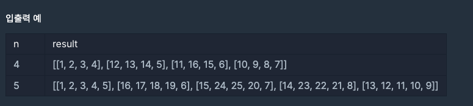
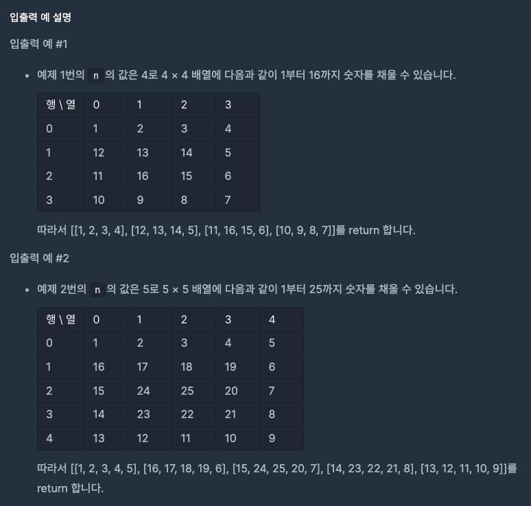

# 정수를 나선형으로 배치하기

   

## 문제설명

---

양의 정수 n이 매개변수로 주어집니다. n × n 배열에 1부터 n2 까지 정수를 인덱스 [0][0]부터 시계방향 나선형으로 배치한 이차원 배열을 return 하는 solution 함수를 작성해 주세요.

  

## 제한사항

---

1 ≤ n ≤ 30

    

## 입출력 예

---

    

## 입출력 예 설명

---

   

<!--
## 접근 및 풀이

--- -->
