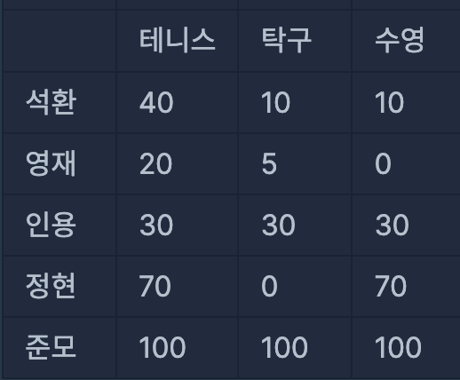

# PCCE 모의고사 1회 체육대회

## 문제설명

<br>

당신이 다니는 학교는 매년 체육대회를 합니다. 체육대회는 여러 종목에 대해 각 반의 해당 종목 대표가 1명씩 나와 대결을 하며, 한 학생은 최대 한개의 종목 대표만 할 수 있습니다. 당신의 반에서도 한 종목당 1명의 대표를 뽑으려고 합니다. 학생들마다 각 종목에 대한 능력이 다르지만 이 능력은 수치화되어 있어 미리 알 수 있습니다. 당신의 반의 전략은 각 종목 대표의 해당 종목에 대한 능력치의 합을 최대화하는 것입니다.

다음은 당신의 반 학생이 5명이고, 종목의 개수가 3개이며, 각 종목에 대한 학생들의 능력치가 아래 표와 같을 때, 각 종목의 대표를 뽑는 예시입니다.



테니스 대표로 준모, 탁구 대표로 인용, 수영 대표로 정현을 뽑는다면, 세 명의 각 종목에 대한 능력치의 합은 200(=100+30+70)이 됩니다.

하지만, 테니스 대표로 석환, 탁구 대표로 준모, 수영 대표로 정현을 뽑는다면 세 명의 각 종목에 대한 능력치 합은 210(=40+100+70)이 됩니다. 이 경우가 당신의 반의 각 종목 대표의 능력치 합이 최대가 되는 경우입니다.

당신의 반 학생들의 각 종목에 대한 능력치를 나타내는 2차원 정수 배열 ability가 주어졌을 때, 선발된 대표들의 해당 종목에 대한 능력치 합의 최대값을 return 하는 solution 함수를 완성하시오.

### 제한사항

- 1 ≤ ability의 행의 길이 = 학생 수 ≤ 10
- 1 ≤ ability의 열의 길이 = 종목 수 ≤ ability의 행의 길이
- 0 ≤ ability[i][j] ≤ 10,000
- ability[i][j]는 i+1번 학생의 j+1번 종목에 대한 능력치를 의미합니다.

<br><br>

## 풀이

처음 문제를 봤을 때는 탐욕법으로 풀면되겠다 생각해서

만약 테니스 - 탁구 - 수영 종목이 있으면

1. 테니스 최대값 pop - 탁구 최대값 pop - 수영 최대값 pop
2. 탁구 최대값 pop - 수영 최대값 pop - 테니스 최대값 pop
3. 수영 최대값 pop - 테니스 최대값 pop - 탁구 최대값 pop

를 구해서 가장 큰 값을 리턴하면 되지 않을까해서 그렇게 접근을 하고 아래의 코드로 풀었다.

```jsx
function solution(ability) {
  var answer = [];

  let visited = new Array(ability[0].length).fill(false);
  let visited_check = false;

  let cnt = 0;

  while (true) {
    if (visited[cnt] == true) break;
    visited[cnt] = true;

    let copy_ab = [...ability];
    let visited2 = new Array(ability[0].length).fill(false);
    let cnt2 = cnt;
    let sum = 0;

    while (true) {
      if (visited2[cnt2] == true) break;
      visited2[cnt2] = true;

      copy_ab = copy_ab.sort((a, b) => a[cnt2] - b[cnt2]);

      let popping = copy_ab.pop();

      sum += popping[cnt2];
      if (cnt2 == visited.length - 1) cnt2 = 0;
      else cnt2++;
    }
    answer.push(sum);
    if (cnt == visited.length - 1) cnt = 0;
    else cnt++;
  }
  return Math.max(...answer);
}
```

위 코드로 테스트 케이스는 맞았는데 나머지 케이스들은 틀렸다.

생각해보니

- 테니스 최대값 pop - 수영 최대값 pop - 탁구 최대값 pop
- 탁구 최대값 pop - 테니스 최대값 pop - 수영 최대값 pop
- 수영 최대값 pop - 탁구 최대값 pop - 테니스 최대값 pop

의 케이스도 다시 구해야해서 그냥 “조합을 이용해서 푸는게 좋지 않을까?” 라는 생각이 들어서 코드를 뜯어고쳤다💦

<br><br>

### 개선한 코드

```jsx
function solution(ability) {
  var answer = 0;
  let max_idx = ability[0].length;
  let visited = new Array(ability.length).fill(false);

  function dfs(sum, visited, idx) {
    if (idx == max_idx)
      if (answer < sum) {
        answer = sum;
        return;
      }
    for (let i = 0; i < ability.length; i++) {
      let visited_1 = [...visited];
      if (visited_1[i] == false) {
        visited_1[i] = true;
        dfs(sum + ability[i][idx], visited_1, idx + 1);
      }
    }
  }
  dfs(0, visited, 0);
  return answer;
}
```

<br><br>

### 테스트 결과


